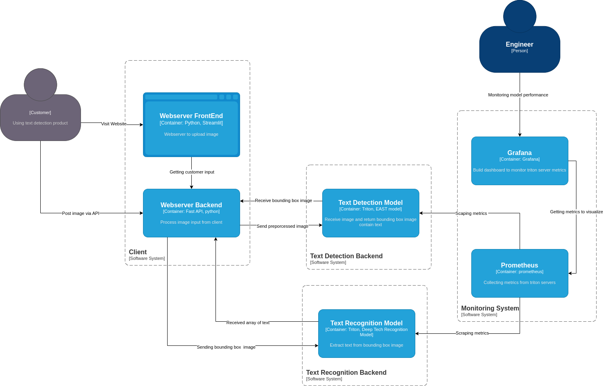
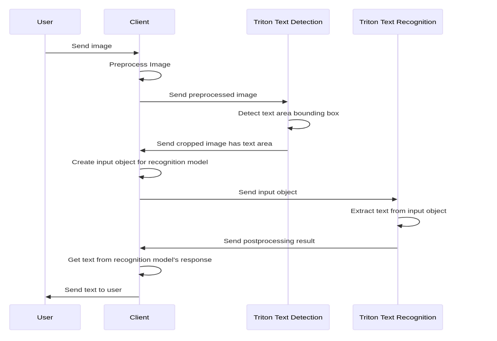

# Demo end-to-end text recognition service using Triton Inference Server, FastAPI and Streamlit

Simple deployment of text recognition service from the Triton Server tutorial https://github.com/triton-inference-server/tutorials
on docker compose. The deployment also consist of prometheus and grafana for monitoring and visualization of Triton model performance

## Overview of architecture

## Data flow

## How to run
Before you begin:
- Install docker and docker-compose (https://docs.docker.com/engine/install/)
- Install Nvidia docker runtime (https://docs.nvidia.com/datacenter/cloud-native/container-toolkit/install-guide.html#docker)

After you have installed the prerequisites, follow the steps below to run the service:
1. Clone the repository
2. Allow the execution of `get_models.sh` bash script by running `chmod +x get_models.sh`. This will download the ONNX model from drop box and extract it to the `server/model_repository` folder. Nvidia has excellent tutorial on how to convert model to ONNX format [here](https://github.com/triton-inference-server/tutorials/blob/main/Conceptual_Guide/Part_1-model_deployment/README.md)
3. Run `docker-compose up` to start the service. This may takes a while as the the docker image for triton server is extremely large (13GB)
4. Open `http://localhost:8501` to access the streamlit app